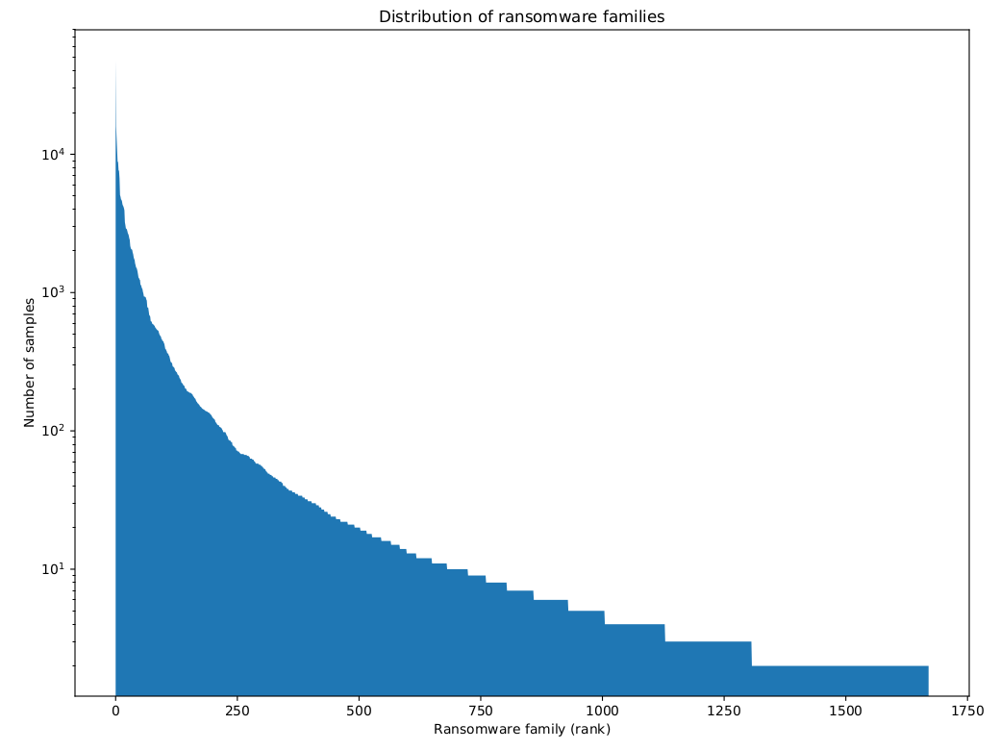
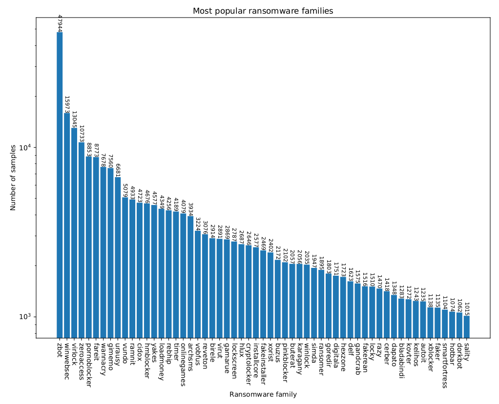

# Ransomware samples dataset

Our ransomware dataset is based on [VirusShare](https://virusshare.com)'s collection of 33.9M samples.
We used John Seymour's [dataset](https://twitter.com/_delta_zero/status/1113477389961416704) containing the VirusTotal [labels](https://www.zerofox.com/blog/labeling-virusshare-corpus/) of all 33.2M samples from June 2012 to February 2019.

We downloaded the [Raw dataset](https://drive.google.com/drive/folders/1oKr5hP8Dlz1QABUOX-HKi2n8tyRkbaDN) and filtered it for all `ransom` detections (using `filter.py`).
The resulting 456856 samples were then classified using the [AVClass malware labeling tool](https://github.com/malicialab/avclass) to group them by family.
This yielded 59339 SINGLETONs, 1717 "families" containing only one sample, and 1832 ransomware families with 2 or more members:

To the surprise of absolutely no one, it's the usual long-tailed distribution.
What is surprising is that the 2-sample families contain some that did make the news, eg. *GoldenEye*, *ZeroLocker* and *Bad Rabbit*.
The 1-sample families contain many generic names like `940677ecdf` or `aawj`, but also known ransomware like *Alcatraz Locker*.

The head end:

